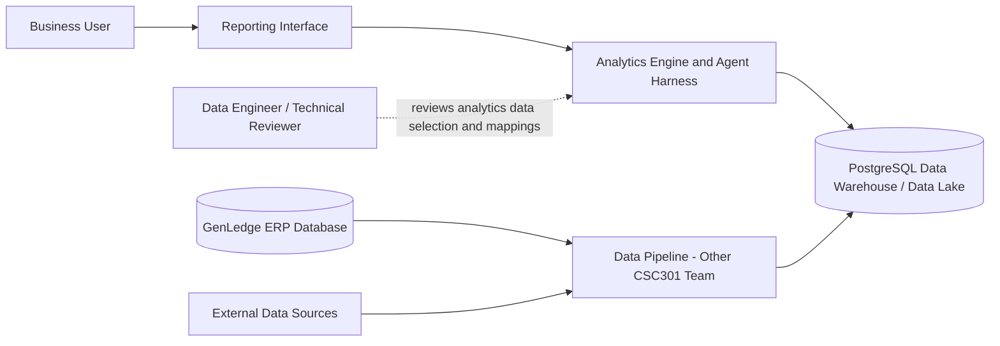
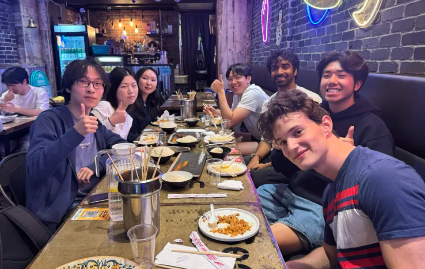

# CSC301 Deliverable 1 [Planning.md](http://Planning.md)

# GenLedge: Agentic AI Analytics & Data Pipeline for ERP - Deliverable 1 Plan

## Product Details

### Q1: What is the product?

We are **developing an agentic analytics capability** for GenLedge's enterprise resource planning (ERP) platform. The goal is to enable AI agents to turn users' requests for reports or analyses into useful analytics, reducing the need for a data engineer to manually build every report.

GenLedge's ERP is already in production. Its existing application consists of a frontend connected to a backend and agent harness, with operational data stored in MongoDB DocumentDB. The analytics system is being developed separately around a reporting interface, analytics engine and agent harness, with a PostgreSQL data warehouse/data lake serving as the analytics data source.

**Current scope understanding:** Our team will focus on the agentic analytics engine and its agent harness. A second CSC301 team working with GenLedge will focus on the data pipeline, which moves data from the ERP database and external sources into the data warehouse/data lake. For our analytics system, the data warehouse/data lake is the source from which relevant data will be selected and mapped to reports.

The two projects can be developed largely independently, but integration points will be identified and refined as user stories and product requirements develop. We will coordinate with the data-pipeline team and share relevant notes and interface decisions as the projects progress.

### Q2: Who are your target users?

The product has two primary user groups: **business users** and **data engineers**.

**Business users** will use the analytics functionality to make changes to existing reports or request relatively simple new reports. As the system develops, the goal is to support increasingly complex reporting requests as well.

**Data engineers** will be involved when structural changes to the analytics environment are required, such as introducing new data sources, tables, or other changes to the underlying data available for reporting.

This distinction allows routine reporting needs to be handled through the agentic analytics system while retaining technical oversight for changes that affect the structure of the analytics data.

### Q3: Why would your users choose your product? What are they using today to solve their problem or need?

Currently, report requests can require a data engineer to manually build or modify a report. The proposed agentic analytics system aims to reduce this manual effort by allowing business users to request reports or adjustments directly while the agent determines the relevant data and produces the requested analytics. Data engineers can then focus more on structural changes, such as adding new sources or tables, rather than handling every routine reporting request.

GenLedge provided several examples of reports the system could support:

- **Sales incentive payout reports:** Weekly or monthly reports calculating incentive payouts for sales teams and individual sales team members. These may incorporate revenue from jobs brought in by the salesperson, profit margins, incentive agreements, customer incentives, cancellations, and resulting clawbacks.
- **Payroll reports:** Reports calculating employee compensation based on factors such as hours worked, number and type of jobs completed, and contracted rates.
- **Management financial reports:** Reports covering areas such as sales, expenses, profit, and operations.

These examples demonstrate why an agentic approach could be useful: the reporting logic can depend on multiple pieces of business and financial data, while users may need to modify existing reports or request new ones over time.

### Q4: What are the user stories that make up the Minimum Viable Product (MVP)?

1. **As a business user, I want to request an analysis or report, so that I can obtain the information I need without requiring a data engineer to manually build every report.**
  - **Acceptance criteria:** The user can submit a report request, and the system either produces the requested report or identifies what additional information is required to continue.
  - Initial report types can be informed by GenLedge's examples, including incentive payout, payroll, and management financial reporting.
  - **Assigned:** Ganesh & Marshal
2. **As a business user, I want the agent to identify and use relevant data from the data warehouse/data lake, so that the resulting report is based on the appropriate available data.**
  - **Acceptance criteria:** The agent selects relevant available data for the request and produces a report using that data.
  - For our team's component, the data warehouse/data lake is the source from which report data and mappings are determined.
  - **Assigned:** Addison & Gandi
3. **As a technical reviewer, I want to inspect the data and mappings selected by the analytics agent, so that I can verify that the report is based on an appropriate interpretation of the request.**
  - **Acceptance criteria:** The system provides sufficient information for a technical reviewer to inspect the agent's proposed data selection or mapping and intervene when human review is required.
  - Human review is relevant to both CSC301 projects but at different boundaries. Our team is concerned with mappings from the data warehouse/data lake into reports, while the data-pipeline team is concerned with mappings from ERP or external sources into the data warehouse.
  - **Assigned:** Gandi & Ethan
4. **As a business user, I want the agent to ask for clarification when my request is incomplete or ambiguous, so that it does not produce a report based on an incorrect interpretation.**
  - **Acceptance criteria:** When information required to correctly interpret a request is missing or ambiguous, the agent identifies the missing information and asks the user for clarification before completing the report.
  - GenLedge confirmed that this clarification workflow is appropriate for the MVP.
  - **Assigned:** Ethan & Chengrui
5. **As a business user, I want to know when the agent cannot complete my request, so that I can modify the request or seek assistance rather than relying on an unsupported result.**
  - **Acceptance criteria:** If the required data is unavailable or the request cannot be completed, the system clearly communicates the limitation and does not present an unsupported result as complete.
  - **Assigned:** Chengrui & Yujin

**Partner review:** These MVP concepts were sent to GenLedge for review. GenLedge confirmed that the proposed workflow, which is requesting a report, identifying relevant available data, requesting clarification when necessary, and clearly handling requests that cannot be completed, is a suitable direction for the MVP. The user stories and acceptance criteria may continue to evolve as product requirements and integration points become more specific.

**Mockup:** Our first interactive prototype is available in [Figma](https://www.figma.com/design/RWN3CkOw0lzZCn4DFbcEUX/GenLedge-%25C2%25B7-Analytics-Assistant-%25E2%2580%2594-Interactive-Prototype?node-id=17-25446&p=f&t=Agtdm9Uu8ONuWML3-0), with a [Loom walkthrough](https://www.loom.com/share/2170564552cb445695b7ad81222e5a31). The prototype was created by our team for partner review and demonstrates the report request, clarification, report output, and traceability workflow.

### Q5: Have you decided how you will build it? Share what you know now or tell us the options you are considering.

The meeting notes describe a high-level analytics flow:

This architecture separates the two CSC301 projects at the data warehouse/data lake boundary. The other CSC301 team's pipeline takes the ERP database or external systems as sources and loads the relevant information into the data warehouse. Our analytics component then treats the data warehouse/data lake as its source and determines the relevant data and mappings needed to produce reports.

GenLedge has confirmed that the two components can be developed largely independently. Our team will nevertheless communicate with the pipeline team and share relevant notes so that assumptions about the data warehouse and integration points remain compatible.

The technology stack for the analytics engine has **not yet been finalized intentionally**. Node.js is the chosen stack for the data-pipeline project, but GenLedge has clarified that this does not require Node.js to be used for the analytics engine. Our team will compare suitable options, including Node.js and Python, and select the technology that best supports the analytics and agentic requirements of our component.

PostgreSQL is currently identified as the data warehouse/data lake technology, while MongoDB DocumentDB is part of the existing ERP environment. Frameworks, LLM/agent APIs, deployment details, and the final data-access interfaces will be refined as the team evaluates the existing system and develops the MVP.

**Coding standards and guidelines:** Every pull request will receive peer review. GenLedge has encouraged the team to develop appropriate engineering practices as the project progresses and identified test-driven development (TDD) as one approach worth considering, while leaving the final development process to the team. We will establish consistent formatting/linting, testing, branching, and review practices as part of our development workflow and document these conventions for all contributors.

## Intellectual Property and Confidentiality Agreement

The initial partner discussion referenced confidentiality and repository-access considerations, but no specific IP or code-sharing agreement has yet been established in the information available to the team.

The course handout states that partners cannot require students to sign legal agreements concerning confidentiality or IP ownership. If any such agreement is requested, we will clarify the requirements with the course teaching team before accepting or signing it. The agreed code-sharing and IP arrangement will be documented once finalized.

## Teamwork Details

### Q6: Have you met with your team?

Yes. On September 30, our team met in person for a team-building activity from approximately **3:00 p.m. to 5:00 p.m.** We first went together to a BBQ restaurant, where we ate and spent time getting to know one another outside of the project. We talked about our backgrounds, interests, experiences, and other personal stories. Afterward, we went for bubble tea and continued talking as a group.

The activity gave us an opportunity to become more comfortable with one another and learn about our teammates beyond their roles in the project before beginning the main development work.

**Team-building activity evidence:**

**Fun facts about our team:**

- Played softball - Addison
- Dog has 13.1K followers - Yujin
- Went to Charli xcx's concert last week - Marshal

### Q7: What are the roles and responsibilities on the team?

Everyone on the team contributes code, and each member also owns an area that matches their experience. Ethan is our dedicated partner liaison. Roles are also listed in `deliverables/team/Team-23-Tokenmaxxers.csv`.

**Roles**

- **Partner Liaison:** main contact with GenLedge and the other GenLedge team; collects the team's questions, sends agendas and follow-ups, and passes decisions back to the team.
- **Scrum Lead:** runs internal meetings, keeps task tracking up to date and follows up on action items and deadlines.
- **Agent Harness:** the agent that interprets report requests, plans the analysis, asks for clarification and handles requests it can't complete.
- **Analytics / Backend:** the analytics engine and APIs that run read-only queries on the data lake and return results. The data lake itself is owned by the other GenLedge team.
- **Full-stack / Reporting:** the reporting interface end to end, from UI (requests, reports, clarification prompts, review screens, error states) to the APIs behind it.
- **DevOps:** environments, CI and deployment so TAs can run and test the app.

**Members**

- **Ganesh Asapu – Agent Harness Lead, Technical Lead.** Builds the core agent runtime and reviews agent-related PRs. Outside of code, he leads technical decisions (stack, architecture) and drafts planning documents. *Why:* conversational AI experience at Voiceflow and internship experience at large tech companies.
- **Marshal Guo – Analytics / Backend Developer.** Builds the analytics engine and the APIs that serve report results. Outside of code, he helps define report metrics with GenLedge. *Why:* worked with large-scale data systems and metrics during his Shopify internship.
- **Gandi Erdenebaatar – Analytics / Backend Developer.** Builds the read-only data access layer and how the agent shows which data it used. Outside of code, she is our contact with the pipeline team on data lake schemas and what data is available. *Why:* experience in data analytics and data engineering.
- **Addison Luo – Scrum Lead, Backend Developer.** Builds how the agent finds and queries relevant data. Outside of code, he runs internal meetings, tracks tasks and keeps meeting minutes. *Why:* full-stack internship experience; took minutes at our kickoff meeting.
- **Ethan Brook – Partner Liaison, Full-stack Developer.** Builds the reviewer approval flow and clarification logic. Outside of code, he is our single point of contact with GenLedge: he sends questions before partner meetings and follows up. *Why:* volunteered to coordinate during team formation; full-stack internship experience.
- **Chengrui Song – Full-stack Developer (Reporting).** Builds the reporting interface, including the request and report views, clarification prompts and error messages. Outside of code, he works on mockups for partner review. *Why:* built analytical dashboards during his internship at an AI startup.
- **Yujin Kim – Full-stack Developer, DevOps.** Builds backend failure detection and handling, and sets up environments, CI and deployment. Outside of code, she maintains the team roster, stakeholder file and README. *Why:* full-stack internship experience across frontend, backend, APIs and cloud infrastructure.

*Note: each MVP user story also has two owners, listed in Q4.*

### Q8: How will you work as a team?

We meet our partner every Thursday at 6:00 p.m. online for a standup on progress, next steps and blockers. We also have our tutorial with our mentor TA, Salman Sayeed, on Thursdays from 7:00 to 7:30 p.m., and hold an internal team sync on Saturdays from 12:30 p.m. to 1:00 p.m. to plan the week and assign tasks. Code reviews happen asynchronously on GitHub: every PR needs at least one teammate's approval, with reviews done within 24 hours. We hold ad hoc coding sessions on Discord when needed.

Our first partner meeting was on Friday, September 25. GenLedge explained their ERP and target analytics architecture. We agreed that our team builds the agentic analytics engine and agent harness, while the other team builds the data pipeline. Our second meeting is planned for Thursday, October 1, to review our user stories, MVP and mockup, and to confirm the confidentiality agreement and repo access. Minutes are in `deliverables/team/minutes/`.

### Q9: How will you organize your team?

We will track our work on a Jira board. GenLedge will invite our team, and we will ask them to add Salman as well. Once we have access, we will write the user stories, split them into tasks with one owner, a priority and a due date each, and use Jira's timeline view to divide work. Until then, we are tracking Deliverable 1 tasks in [Linear](https://linear.app/csc301-team/team/CSC/active). Code and reviews live on GitHub, minutes are kept in the repo, Discord is for team chat and WhatsApp is for quick questions with GenLedge.

MVP stories agreed with GenLedge come first, followed by blocking work (data access, agent harness, analytics API) before the features that depend on it. After that, whatever is due soonest goes first. Tasks are assigned at the weekly team sync based on each person's role, interests and workload. High-impact tasks only go to someone confident they can deliver production-quality code. Issues move from Backlog → Todo → In Progress → In Review → Done. A task is only Done once its PR is approved by a teammate and merged.

### Q10: What are the rules regarding how your team works?

- WhatsApp is our channel with GenLedge (Kulwant Yadav and Sapna Singhal).
- Discord is for day-to-day coordination inside the team, including quick questions, blockers, and asking for PR reviews.
- Our task board holds every task with its owner, due date and status: Jira once GenLedge gives us access, Linear until then (see Q9). GitHub PR comments are for code discussion.

Messages that need an answer get one within 12 hours on weekdays and 24 hours on weekends. PR reviews are done within 24 hours (see Q8).

Ethan is our single point of contact with Kulwant and Sapna. Our process:

- During the week, team members add questions for GenLedge to a shared list in Discord instead of messaging Kulwant and Sapna individually.
- Ethan posts the questions in the WhatsApp group before each partner meeting.
- Course and admin questions go in the WhatsApp group before the meeting, not by email. GenLedge asked us to keep partner meetings for stand-up updates: what we did, what we're doing next, and blockers.
- At least three team members attend every partner meeting.
- We expect replies within two business days for our questions. If we haven't heard back by then, Ethan sends one follow-up.
- If a question has blocked our work for a week, we tell our TA. We then continue on a stated assumption, which we note in this document until GenLedge confirms or corrects it.

Accountability

- If you can't attend a meeting, let the group know before it starts, ideally a day ahead, and post a short written update (what you finished, what's next, what's blocking you).
- Every action item from a meeting becomes a ticket on our task board with one owner and a due date.
- If someone misses a due date or goes quiet for 48 hours on work they own, Addison, as Scrum Lead, checks in privately and asks if they need help or want to hand it off.
- If the work is still stuck at the next team sync, we raise it as a team and reassign or re-scope it.
- If the same person keeps missing commitments for two more weeks, we email our TA with the task board, GitHub and minutes record.

Code process (GenLedge's, from our Oct 1 meeting):

- Feature branches merge into dev, then staging, then main.
- Before pushing, pull the latest dev, merge it locally and test that everything works.
- Every PR is reviewed by at least one teammate, who also runs and tests it, before it merges. Nobody merges their own PR.
- If you change someone else's code, explain why in the PR.
- Before building a feature, we write a plan with a coding agent, save it in the repo's `/docs` folder, and update it when the code changes.

## Organisation Details

### Q11: How does your team fit within the overall team organisation of the partner?

GenLedge has a team of roughly 10 to 12 people who built and run its ERP platform: the frontend, the backend with its agent harness, and the DocumentDB database. Two CSC301 teams are now adding an analytics product on top of it:

- The other team owns the agentic data pipeline, which brings ERP and external data into the warehouse, and owns the data warehouse/data lake itself.
- We own the part that turns warehouse data into reports: the analytics engine, its agent harness, and the reporting interface.

Our role is product development: building a feature set GenLedge doesn't have yet, not testing or maintaining existing code. Here is why we think this fits:

- GenLedge split the architecture into a left half that is already built and a right half that is new, and put analytics and reporting on our side.
- GenLedge asked us for our own user stories, an updated architecture, and which member owns which story. That is what a feature team hands back, not what a team working through an assigned ticket list produces. They also left the tech stack and our success targets for us to decide.
- The documentation Sapna Singhal sent us describes a connector whose dashboard page shows no metrics, and GenLedge's project description lists a working report with drill-down (D8) as an open deliverable. Reporting doesn't exist yet.
- We follow GenLedge's engineering process (peer-reviewed PRs, and dev, staging and main branches) in our own private repository. GenLedge can't share its code or use ours until the NDA/IP question is resolved. If it is, the repo moves into GenLedge's.

GenLedge asked both CSC301 teams to focus on the agent harness (see Q12).

We are not QA or maintenance for the pipeline. When our work exposes a pipeline problem, such as a table missing a column we need, we report it to the pipeline team rather than fix it ourselves.

Our contacts at GenLedge are its founders, Kulwant and Sapna, and Ethan is our liaison with both. We share a WhatsApp group and a weekly meeting with them and the pipeline team. Our PRs are reviewed by one other member of our team.

### Q12: How does your project fit within the overall product from the partner?

GenLedge's ERP uses AI agents to carry out business workflows so people don't have to click through software. The analytics project applies the same idea to reporting. Today, someone who needs a report asks a data engineer, who finds the data, joins it, writes the calculation and builds the report. The goal is for agents to do that work while people review it.

| Layer                      | What it does                                                                                                                                                                 | Owner                                                                                                                 | State today                                                                                  |
| -------------------------- | ---------------------------------------------------------------------------------------------------------------------------------------------------------------------------- | --------------------------------------------------------------------------------------------------------------------- | -------------------------------------------------------------------------------------------- |
| ERP application            | Frontend, backend and agent harness; operational data (jobs, sales, technicians, transactions, inventory) in AWS DocumentDB                                                  | GenLedge                                                                                                              | In production                                                                                |
| Agentic data pipeline      | Brings ERP data (DocumentDB) and external files such as CSV and JSON into the warehouse. An agent maps source fields to warehouse tables, and a person reviews the mappings. | Other CSC301 team, building from scratch, since GenLedge's code can't be shared until the NDA/IP question is resolved | Early stage                                                                                  |
| Data warehouse / data lake | Tables the pipeline loads and our agent reads. The pipeline team is still designing them.                                                                                    | Other CSC301 team (see Q7)                                                                                            | Postgres. It's the only technology GenLedge has fixed, and Kulwant said we can challenge it. |
| Analytics and reporting    | An agent reads the warehouse, works out the data and calculation a request needs, produces the report and shows how it got there; plus a reporting interface for users       | Us                                                                                                                    | [Figma prototype](https://www.figma.com/design/RWN3CkOw0lzZCn4DFbcEUX/GenLedge-%25C2%25B7-Analytics-Assistant-%25E2%2580%2594-Interactive-Prototype?node-id=17-25446&p=f&t=Agtdm9Uu8ONuWML3-0) done, no code yet. GenLedge left the stack to us (see Q5).                   |

We are building the first working version of the analytics layer. Our only input is what the pipeline loads. GenLedge expects the two components to be developed largely independently (Q5), but they meet at the warehouse schema:

- The pipeline team is designing the warehouse tables from scratch, so table names and columns will change during the term.
- We plan to have our agent read a table catalogue the pipeline team maintains (table descriptions, columns, keys) to learn what data exists, instead of hardcoding table names. Both teams need to agree on this interface (see Q14).

GenLedge sees the agent harness as the key part of this project: the tools, context, memory and instructions around the model. Kulwant asked both teams to spend most of their time there rather than on the UI or backend, and to present their harness research and proposed architecture at the next partner meeting. He has no preference on whether the two teams share one harness or build separate ones, so both teams will decide that together (see Q14).

Human review happens at two boundaries (Q4, story 3). The pipeline team reviews how source data is mapped into the warehouse. We review which warehouse data and mappings our agent selects for a report, and when the agent is unsure, a person checks the report before anyone sees it.

GenLedge's project description defines success for the whole analytics effort like this:

- A configuration user describes a customer's data and the analytics they want.
- Agents build most of the pipeline, and a person approves it.
- The result is a report the customer can trust.

Its exit criteria include at least one working report with a business-level calculation and drill-down to the supporting records, plus a demo showing the agent doing work a data engineer would otherwise do.

The reference case is an HVAC company's technician payout and commission report:

- Combine job records, technician and salesperson attribution, external funding status and the company's payout rules.
- Calculate what each person is owed.
- Let the user drill into the jobs and rules behind every amount.

In our Oct 1 meeting, Kulwant said GenLedge's goal is a working autonomous data pipeline and an autonomous reporting engine, one per team, and that we should define our own targets. He told us to build the engine first and the reports on top. Our success definition for this term:

- A user asks for a report in plain language, and the agent plans the analysis, picks the data, asks when something is unclear, and stops when the data isn't there.
- It produces one report type correctly from the warehouse. We start with a monthly cash-flow summary, a management financial report (Q3) that our prototype already shows, then add GenLedge's other report types.
- Every number traces back to the rows behind it.
- Anything the agent is unsure about goes to a person first.

## Potential Risks

### Q13: What are some potential risks to your project?

1. **The interface with the pipeline team at the data warehouse isn't agreed in detail.** Everything our engine reads, the pipeline writes. The pipeline team is building it from scratch, so the table names, columns and keys don't exist yet and will change during the term. Without an agreement, we either hardcode one client's schema or ship reports that break silently when a table changes. GenLedge has also left open whether both teams share one agent harness. If we share it without clear ownership, one team's change could break the other's agent. If we build two, we duplicate work.
2. **Pipeline data can be wrong in ways that make our numbers wrong.**  
The pipeline is new, so early loads may have bugs: duplicate rows when a load is re-run, missing loads, or values converted inconsistently. In a payout report, a job loaded twice is a commission paid twice, and an agent presenting that number confidently is worse than no report. We don't control the fix.
3. **Our scope is ours to define, and GenLedge cares most about the agent harness.**  
GenLedge didn't choose a first report or a success target for us. Kulwant told us to build the engine first and set our own targets. If we aim too big, we finish nothing; if we aim too small, the harness is never tested on real reporting logic. He also said he cares most about the agent harness, not the UI or backend, so time spent polishing screens is time not spent on what GenLedge values.
4. **The agent can produce an analysis that looks right and isn't.**  
A wrong join, filter or date range still returns a plausible number, and the same question can get different answers on different runs. GenLedge wants reports people can trust, and a payout report decides what people get paid. Without a way to check each result, nobody can tell a wrong report from a right one.
5. **Client data could leak across clients or to the model.**
  - Across clients. Reports are client-facing, and the warehouse holds data for many clients. An agent that writes SQL could query another client's data if the database allows it, and a prompt instruction is not a security boundary.
  - To the model. An agent that explains results has to see real results (names, amounts, commissions), and GenLedge hasn't set a policy on what customer data the model can see.
6. **The stack is ours to choose, and the data store is an open question.**

- Kulwant told us to pick whatever stack works best for our part. Postgres is the only decision GenLedge has made, and he said we can challenge it: relational databases are good for analytics, but whether they suit agentic analytics is still open. In our Oct 1 meeting he added that Node.js and Python are both fine at our scale and we shouldn't spend long debating.
- Changing the data store would affect the pipeline team too, since they own the warehouse (Q7).
- GenLedge prefers AWS but isn't requiring it, so where we host and test is also our decision.
- We still have to choose between Node.js and Python and how reports are displayed (QuickSight was suggested in GenLedge's project description but isn't required). Debating these too long takes time away from the agent harness.

1. **The NDA/IP question is unresolved, so we have no repository access or real data, and GenLedge can't use our code yet.**  
GenLedge can't share its code or customer data unless we sign an NDA/IP agreement, and can share only part of its schemas. The course handout says partners can't require us to sign, and we are waiting on Professor David. GenLedge also can't use our code unless the NDA/IP question is resolved.

### Q14: What are some potential mitigation strategies for the risks you identified?

1. **Boundary.** Our Technical Lead drafts a one-page interface agreement with the pipeline team, and both teams and GenLedge approve it. Proposed terms:

- The pipeline owns all table creation and loading.
- We get read-only access to the warehouse and to a table catalogue the pipeline team maintains (descriptions, columns, keys).
- Our agent reads the catalogue at runtime instead of hardcoding names.
- The pipeline team flags breaking changes in the shared WhatsApp group before merging them.
- The two teams hold a short sync every two weeks.
- The agreement settles whether the two teams share one agent harness or build separate ones (GenLedge has no preference). If shared, it says who owns which parts and how changes to it are reviewed.
- Both teams present harness research at the next partner meeting, so we compare our proposals with theirs beforehand and don't present two that conflict.

On our side, each report records which tables and columns it depends on. A missing column then produces a clear error, not a wrong number.

1. **Upstream data.** Before calculating anything, our engine checks its input:

- duplicate rows on the table's row key,
- when the table was last loaded successfully,
- how many rows the table holds.

If a check fails, the report shows a warning or refuses to calculate. We will ask the pipeline team to make loads safe to re-run, so a second run updates rows instead of duplicating them. We won't demo money figures until that is fixed or our duplicate check is in place.

1. **Scope.** We follow Kulwant's advice: build the agent harness and engine first, then reports on top.

- Our first report is a monthly cash-flow summary on synthetic data, the flow our prototype already shows. GenLedge's three report types (Q3) come after the engine works.
- We present our harness research and proposed architecture at the next partner meeting, and post it in the WhatsApp group a day before.
- We use coding agents for UI and backend work, as GenLedge recommended, to keep most of our time for the harness.

1. **Wrong but plausible results.** Make every result checkable:

- Each report shows the calculation in plain language, the query behind it, and the tables and row counts used.
- The user can drill into the rows behind any number.
- Agent-written queries are checked before they run: read-only, limited to the caller's data, and capped in rows.
- We build an evaluation set: synthetic data with known correct totals, a list of standard requests, and a script that compares the agent's numbers to the known answers. It runs on every PR that changes the agent.
- When a query fails a check or the agent reports low confidence, the result goes to a person instead of straight to the user.

1. **Client isolation and data sent to the model.**

- Enforce isolation in the database, not the prompt: one read-only database role per client, limited to that client's data.
- The client is resolved on the server from the signed-in session, never taken from the model or the request.
- Until GenLedge sets a policy, the model sees schemas, aggregates and small samples, not full result sets.
- Every route we add checks the session and the client.

1. **Platform.**

- Pick Node.js or Python at our next team sync. GenLedge said either works and not to spend long on it.
- Test early whether Postgres suits agentic analytics by running the agent's queries against our synthetic dataset. If it doesn't, propose an alternative to GenLedge and the pipeline team together, since they own the warehouse.
- Keep all data access in one module, so changing the data store later stays contained.
- Keep the reporting interface behind our own API, so the choice of reporting tool doesn't force a rewrite of the engine.

1. **Data and access.**

- Build a synthetic or public transactions dataset with known correct totals, as GenLedge suggested. Once the pipeline team can load files, load it through their pipeline so it has the same shape as real pipeline output.
- Ask Kulwant for the partial schema guidance he offered, so our synthetic tables look like GenLedge's.
- Build in our own private repository with GenLedge's PR process, and move it into GenLedge's if the NDA/IP question is resolved.
- Don't agree to any NDA/IP option, in writing or out loud, until Professor David responds. Kulwant pointed out that any agreement is binding.

